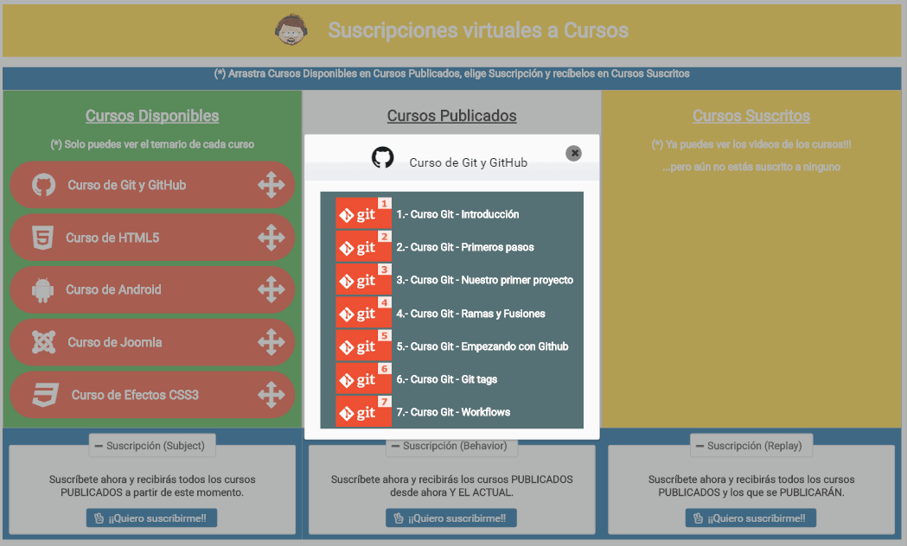

# Suscripciones a Cursos (Subject Behavior Replay)
Ejemplo de una simple aplicación para publicar cursos virtuales y suscribirse a ellos de diferentes maneras, bien sea a través de un Subject, un BehaviorSubject o un ReplaySubject. 
También se prueba la librería ngPrime (Primefaces para Angular). 
Se puede suscribir a los cursos y ver los capítulos de los que consta.  
Se comenta a continuación que es un subject y los 3 principales subjects que hay.

## Demo 
Demo [aquí](https://angulartraining-subject-cursos.firebaseapp.com) 

<p align="center"> 
   <span></span> 
</p> 


## Subject, BehaviorSubject, ReplaySubject

### Subjects
Documentación [aquí](http://reactivex.io/documentation/subject.html)   
Un subject actúa a la vez como observador y como un observable. Debido a que es un observador, puede suscribirse a uno o más observables, y porque es un observable, emitir valores a sus observers.

Por ejemplo un subject que emite el un valor a sus observers
```bash
let subject = new Subject <string>();
subject.next('1');
```
El subject se puede publicar como observable para poder ser observado
```bash
let subject = new Subject <string>();
// se publica como observable, ahora se pueden suscribir a sus emisiones
let subject$ = subject.asObservable();

let observer = subject$.subscribe (console.log)
subject.next('1');
subject.next('2');
....
```
Y tb podrá emitir error y complete
```bash
subject.error('Error forzado!');
subject.complete(); 
```

### Diferencias 
 Todos los mencionados son subject pero difieren en los siguientes aspectos
 Cuando un observer se suscribe a un subject, este comienza a recibir eventos a partir de ese momento
 ```bash
  let subject = new Subject <string>();
  // se publica como observable, ahora se pueden suscribir a sus emisiones
  let subject$ = this.subject.asObservable();
  subject.next('1');
  subject.next('2');
  observer = this.subject$.subscribe(console.log);
  subject.next('4');
  subject.next('5');
  //pintará por consola 4 y 5 
  subject.complete();
  observer.unsubscribe();
 ```

 Cuando un observer se suscribe a un BehaviorSubject este recibe el último valor emitido y todos lo valores que se emitan a continuación. El Behavior necesita de un valor inicial!
  ```bash
  let behaviorSubject = new BehaviorSubject <string>('');
  // se publica como observable, ahora se pueden suscribir a sus emisiones
  let behaviorSubject$ = this.behaviorSubject.asObservable();
  behaviorSubject.next('1');
  behaviorSubject.next('2');
  observer = this.behaviorSubject$.subscribe(console.log);
  behaviorSubject.next('4');
  behaviorSubject.next('5');
  //pintará por consola 2, 4 y 5 (el 2 es el último valor prevcio a suscripción)
  behaviorSubject.complete();
  observer.unsubscribe();
 ```

 Y cuando un observer se suscribe a un ReplaySubject este recibe todos los valores emitidos previamente y todos lo valores que se emitan a continuación 

  ```bash
  let replaySubject= new ReplaySubject<string>();
  // se publica como observable, ahora se pueden suscribir a sus emisiones
  let replaySubject$ = this._replaySubject.asObservable();
  replaySubject.next('1');
  replaySubject.next('2');
  observer = replaySubject$.subscribe(console.log);
  replaySubject.next('4');
  replaySubject.next('5');
  //pintará por consola 1, 2, 4 y 5 
  replaySubject.complete();
  observer.unsubscribe();
 ```

 Ver ejemplos en ejemplo.component.ts. Ver resultado de consola aquí [aquí](https://angulartraining-subject-cursos.firebaseapp.com/ejemplo) 

## Estructura módulos
La jerarquía de módulos se establece de la siguiente forma
App (bootstrap->LayoutComponent)
 <ul>
  <li>core (exporta LayoutComponent)</li>
  <li>cursos</li>
  <li>ejemplo-consola</li>
</ul>

### Mapa
<p align="center"> 
   <span></span> 
</p> 

El core.module encapsula la estructura principal de la aplicación a través del componente LayoutComponent. Lo hace visible al AppModule   
```bash
exports: [
    LayoutComponent
  ]
```
y hará el bootstrap de la aplicación en el AppModule
```bash
NgModule({
  declarations: [],
  imports: [
    BrowserModule,
    CoreModule,
    FormsModule,
    HttpModule,
    .....
  ],
  providers: [],
  bootstrap: [LayoutComponent]
})
```

Este componente renderiza en su template simplemente el <router-oulet> principal de la aplicación, ya que carecemos de menu
```bash
<router-outlet></router-outlet>
```

 ## Lazy-Loading
Los módulos son cargados dinámicamente. Se genera bundle (chunks) de cada uno y se cargan bajo demanda

```bash
  const routes: Routes = [
    { path: 'ejemplo',  loadChildren:   'app/ejemplo-consola/ejemplo-consola.module#EjemploConsolaModule'},
    { path: '', loadChildren: 'app/cursos/cursos.module#CursosModule' }
  ];
```

## Primefaces (ngPrime)
Para este ejemplo se utiliza ngPrime (Primefaces para Angular)
Ver documentación [aquí](https://www.primefaces.org/primeng/#/)  

Para instalar librerías 
```bash
 npm install primeng --save
 npm install @angular/animations --save
 npm install font-awesome --save
``` 
Añadir dependencias de css
```bash
 "styles": [
            "../node_modules/primeng/resources/primeng.min.css",
            "../node_modules/primeng/resources/themes/omega/theme.css",
            "../node_modules/font-awesome/css/font-awesome.min.css",
            ...
        ]
```
Importar animaciones en el módulo root app 
```bash
 imports: [
    BrowserModule,
    FormsModule,
    BrowserAnimationsModule,
  ....
 ```
 y para cada componente que utilizemos, es necesario importar de igual forma el módulo correspondiente (para componente OrderList por ejemplo)  
```bash
 imports: [
    BrowserModule,
    FormsModule,
    BrowserAnimationsModule,
    OrderListModule
```
En este caso lo meteremos en el cursos.module

### Evento Drag Drop
Para mobile este evento de html nativo no es [soportado]([https://www.codeproject.com/Articles/1091766/Add-support-for-standard-HTML-Drag-and-Drop-operat), por ello incluimos un polyfill (DragDropTouch.js) en el angular-cli.json
```bash
 "scripts": [
            "../src/third-parts/DragDropTouch.js"
        ]
```
## Documentación
Ver Documentacion de la aplicación [aqui](https://angulartraining-subject-cursos.firebaseapp.com/documentation/) 

### Generar documentación

Instalación global
```bash
npm install -g @compodoc/compodoc
```
Instalación local
```bash
npm install --save-dev @compodoc/compodoc
```
Definir script en package.json (se añade -a screenshots para llevar la carpeta de screenshots al generado, y el theme)
```bash
"scripts": {
    ...
  "compodoc": "./node_modules/.bin/compodoc -p tsconfig.json -a screenshots"
}
```
Lanzar script 
```bash
npm run compodoc
```
Se genera carpeta /documentation

## Deploy firebase
Se crea script en el package.json que borra /dist, genera el build para prod, documentación y despliega en firebase  
```bash
"scripts": {
    ...
  "compodoc": "./node_modules/.bin/compodoc -p tsconfig.json -a screenshots",
  "deploy-firebase": "del dist && ng build --env=prod --aot && npm run compodoc && move documentation dist && firebase deploy"
}
```

